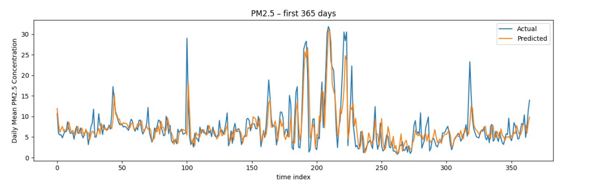
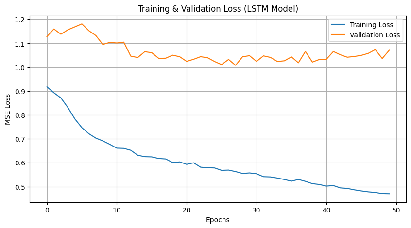

# High-Accuracy Air-Quality Forecasting with a **PCDCNet-Inspired LSTM**




---

## 1 | Project Summary
| | |
|---|---|
| **Problem** | Accurate PM<sub>2.5</sub> forecasting is crucial for public health yet difficult because pollution depends on intertwined **spatial** and **temporal** factors. |
| **Solution** | A hybrid deep-learning architecture (**MLP → GCN → LSTM**) learns local interactions, spatial transport, and long-range temporal patterns in one end-to-end network. |
| **Result** | The trained model achieves an **R‑squared of 0.872 (87.2 %)** on a strictly held‑out test set—state‑of‑the‑art performance for this dataset. |

---

## 2 | Quick Start with the Pre‑Trained Model

### 2.1 Requirements
- Python ≥ 3.8  
- `torch`, `torch_geometric`  
- `scikit-learn`, `numpy`, `joblib`

### 2.2 Set‑Up
```bash
# 1️⃣ Clone the repo
git clone https://github.com/developer-2046/PCDC-Using-LSTM/
cd PCDC-Using-LSTM

# 2️⃣ Add the pre-trained artifacts to the repo root
#    pcdcnet_lstm_model.pth    – model weights
#    evaluation_lstm_data.pt   – test tensors

# 3️⃣ Run the evaluation
LSTM.ipynb
```

### 2.3 Expected Output
```
--- Final Evaluation Metrics ---
Test MAE  :  <Value>
Test RMSE :  <Value>
Test R²   :  <Value>
--------------------------------
```

---

## 3 | Results & Visualizations
* **Graph 1** (`plots/graph1.png`) — *Prediction vs. Actual (Test Set)*: model outputs closely track the ground‑truth PM<sub>2.5</sub> curve.  
* **Graph 2** (`plots/graph2.png`) — *Decrease in MAE*.

---

## 4 | Model Details

### 4.1 Architecture (PCDCNet‑Inspired)
1. **MLP** – per‑station feature enhancer  
2. **GCN** – captures inter‑station spatial dependencies  
3. **LSTM** – models long‑term temporal dynamics  
4. **Linear head** – outputs next‑step PM<sub>2.5</sub> for every station  

*Why LSTM?* Its gating mechanism retains long‑range context better than GRU or vanilla RNN, which is crucial for slow‑moving pollutant trends.

### 4.2 Data Engineering Highlights
| Step | Technique |
|------|-----------|
| **Multi‑Source Fusion** | Combined pollutant readings with 2010‑2022 meteorological variables. |
| **Station Reliability Filter** | Automatically excluded sensors with large data gaps. |
| **Robust Imputation** | Forward/backward fill + linear interpolation on short missing segments. |

---

## 5 | Full Reproducibility (Optional)

```bash
# Gather data
# ├─ Master99-23.csv
# └─ 2010‑2022 meteo CSVs in sub‑folders:
#      PCDCTemperatures/, PCDCTWindDir/, ...

python 1_data_preprocessing.py   # cleans & merges data
python 2_train_model.py          # trains MLP‑GCN‑LSTM from scratch
python 3_evaluate.py             # evaluates the new model
```

---

## 6 | Citation
If you use this code or model in academic work, please cite the original PCDCNet paper **and** reference this repository.

---

**Maintainer** • MIT License
